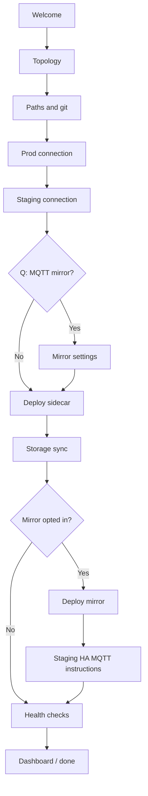

# Onboarding wizard — design

**Tracking:** Epic (kit repo) · extends HomeAssistant [#23](https://github.com/Unthred/HomeAssistant/issues/23) web console

## Goal

First-run experience that walks a new user from **zero** to **working staging** without reading shell scripts or editing YAML by hand. Optional branches (MQTT mirror, control mode) are explicit choices — not hidden manual steps.

## Personas

| User | Needs |
|------|--------|
| **New adopter** | Cloned kit + HA config repo; may have prod HA Green + staging Docker |
| **You (Yeradonkey)** | Migration from Unraid scripts; preserve appdata secrets |
| **Future community user** | Generic LAN; no Yeradonkey hostnames |

## Wizard outcomes

On completion the wizard produces:

| Output | Location |
|--------|----------|
| `.env` | Kit root — host paths, MQTT prod host, ports |
| `config.env` | `$SIDECAR_DATA/` — sidecar runtime |
| `secrets/*` | Tokens, SSH key (write-only in UI; never re-displayed) |
| Mirror config | `$MIRROR_DATA/config/` if user opted in |
| **Summary report** | What was configured, what to do in staging HA UI (MQTT) |

## Flow (high level)



## Steps (detailed)

### 1. Welcome

- What this kit does (sidecar + optional mirror)
- Prerequisites checklist (Docker, compose, LAN access to prod + staging)
- Link to HA config repo (separate git)

### 2. Topology

Ask (radio):

- Prod HA: **Physical / HA OS** · **Docker** · **Other**
- Staging HA: **Physical / HA OS** · **Docker** · **Other**
- Same host as kit? Y/N

→ Sets defaults for URLs (`127.0.0.1` vs LAN IP) and documents SSH vs Docker exec patterns.

### 3. Paths and git

| Field | Example |
|-------|---------|
| HA config git clone path | `/path/to/HomeAssistant` |
| Git branch for staging | `staging` |
| Staging HA config directory | appdata or `/homeassistant` mount |
| Sidecar data directory | `./data/sidecar` or appdata path |
| Mirror data directory | `./data/mirror` (if mirror later) |

Validate: git repo exists, branch exists, staging path writable.

### 4. Prod connection

| Field | Purpose |
|-------|---------|
| Prod HA URL | Person sync read |
| Prod SSH `user@host:/homeassistant/` | secrets + `.storage` sync |
| SSH private key upload | Or paste path on host |
| Prod long-lived token (read) | Person/tracker poll |

**Test buttons:** SSH echo, REST `/api/` with token.

### 5. Staging connection

| Field | Purpose |
|-------|---------|
| Staging HA URL | Person sync write, health check |
| Staging long-lived token (write) | Person poll |

**Test button:** REST states write (dry-run or read back).

### 6. MQTT mirror (optional)

> **Do you want live device states from prod on staging?** (Zigbee/MQTT mirror)

If **No:** skip to deploy; staging uses its own MQTT or none.

If **Yes:**

| Field | Purpose |
|-------|---------|
| Prod Mosquitto host:port | Bridge target |
| Confirm prod broker reachable | TCP check |
| Explain: staging HA must point MQTT at mirror | Show generated instructions |

Sub-question: **Control mode** — explain read-only default; do not enable during onboarding.

### 7. Deploy

- Build + start sidecar (`docker compose`)
- Run `apply-config.sh`
- Show log tail

### 8. Storage sync (first run)

- Explain why (registry, MQTT creds in `.storage` for mirror)
- Run sync; show progress
- Required before mirror if mirror opted in

### 9. Deploy mirror (if opted in)

- Run `deploy-mirror.sh` logic
- Verify `zigbee2mqtt/bridge/state` on mirror

### 10. Staging HA MQTT (if mirror)

Platform-specific instructions generated from topology step:

- **Docker staging:** extra host / broker URL env
- **HA OS:** Mosquitto add-on or core-mosquitto integration config snippet
- Link to kit doc `docs/staging-ha-mqtt.md`

User confirms: **“I’ve pointed staging HA at the mirror”** (checkbox).

### 11. Health checks

| Check | Pass criteria |
|-------|----------------|
| Sidecar running | container up |
| Person sync | 1+ states synced |
| Git apply | overlay file present |
| Mirror (if enabled) | bridge connected, topic sample |
| Staging HA UI | HTTP 200 |

### 12. Done

- Summary + “what’s next” (edit HA YAML on staging, promote workflow)
- Redirect to **console dashboard** (default landing after first run)

## Implementation phases

| Phase | Delivery | Repo |
|-------|----------|------|
| **A** | Manual docs (`setup.md`, `person-presence-sync.md`, …) | ha-staging-kit |
| **B** | Console API — onboarding endpoints + validation helpers | ha-staging-kit |
| **C** | **Web onboarding UI** — first-run wizard SPA (progress bar, test buttons, deploy) | ha-staging-kit |
| **D** | Re-run / edit settings from console Settings page | ha-staging-kit |

**Web UI only** — no interactive CLI wizard. New users open the console in a browser; the SPA walks through the steps below. Host scripts remain for operators who prefer them, but onboarding is not bash-based.

Depends on console skeleton (HomeAssistant [#24](https://github.com/Unthred/HomeAssistant/issues/24)); onboarding is the **first-run route** of the same SPA as dashboard/settings/operations.

## API (console backend)

```
GET  /api/onboarding/status     → step, completed, blockers
POST /api/onboarding/topology
POST /api/onboarding/paths      → validate + write .env
POST /api/onboarding/secrets    → write tokens (write-only)
POST /api/onboarding/test/ssh
POST /api/onboarding/test/prod-api
POST /api/onboarding/test/staging-api
POST /api/onboarding/test/mqtt
POST /api/onboarding/deploy
POST /api/onboarding/mirror     → optional
GET  /api/onboarding/report     → generated summary
```

## Web UI (SPA)

- **Route:** `/onboarding` (first visit) → `/` dashboard when complete
- **Layout:** stepped wizard — sidebar progress, main panel for current step, sticky **Back / Next / Test** actions
- **Components:** topology radios, path pickers (with “browse” hints for Docker mounts), password-style token fields, SSH key upload, optional mirror card with plain-language explainer, deploy log stream, health-check result cards (green/amber/red)
- **Aesthetic:** calm, HA-adjacent — cards, status chips, no terminal chrome unless showing deploy logs
- **Mobile:** usable on phone over LAN for “confirm staging MQTT” step

## UX principles

- **Progress bar** with back/next; save state to `$SIDECAR_DATA/onboarding.json`
- **Plain language** — no “sidecar” without one-line explanation
- **Safe defaults** — mirror read-only; control mode not in onboarding
- **Never show secrets** after save — “configured ✓”
- **Copy-paste blocks** for staging HA MQTT step
- **Skip/resume** — partial setup saved

## GitHub tracking

Epic and child issues on **Unthred/ha-staging-kit** project board. Linked from HomeAssistant #23.

## Related

- [README.md](../README.md)
- [architecture.md](architecture.md)
- [person-presence-sync.md](person-presence-sync.md) — why prod read + staging write tokens exist
- HomeAssistant [design-staging-console.md](https://github.com/Unthred/HomeAssistant/blob/staging/docs/design-staging-console.md)
